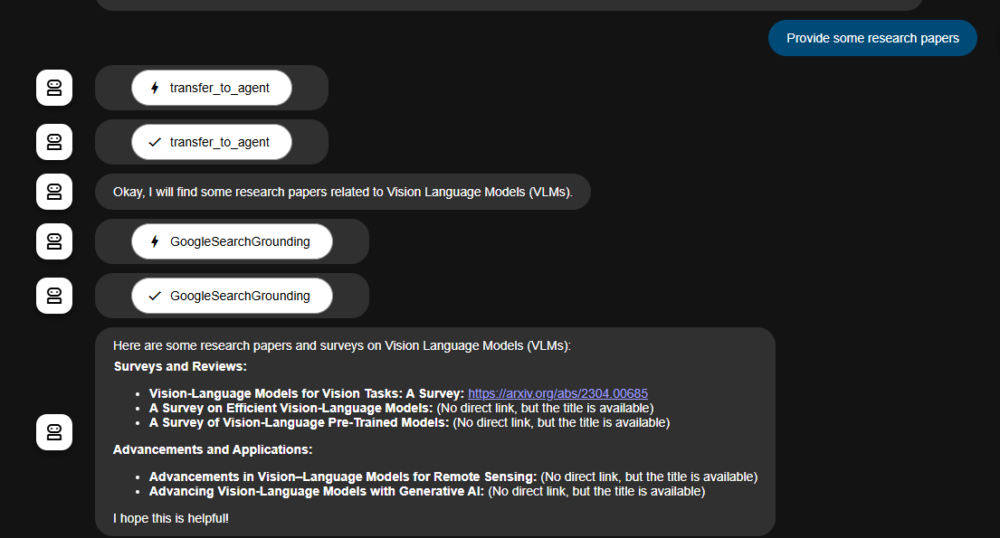

# Research Paper Agents

This project defines a modular system of LLM-based agents designed to assist with research tasks like literature review, knowledge graph generation, research gap identification, and more. It uses Google's ADK (`google.adk`) and Gemini models for orchestration.

---

## ✨ Features

- Modular design with task-specific LLM agents.
- Uses Google Search (including Google Scholar) to find academic resources.
- Supports both ADK Web and ADK API Server modes.
- Easily extendable with more tools and sub-agents.

## 🧠 Agents Overview

### 🔍 `GoogleSearchGrounding`
- **Purpose:** Performs Google/Google Scholar searches for grounding and discovery.
- **Tool Used:** `google_search`

### 📄 `PapersTitleAndLinkAgent`
- **Purpose:** Collects research paper titles and their corresponding links using web search.
- **Tool Used:** `google_search`

### 🧠 `KnowledgeGraphAgent`
- **Purpose:** Builds a knowledge graph of entities, attributes, and relationships related to the query.
- **Tool Used:** `google_search`

### 🔬 `ResearchGapAgent`
- **Purpose:** Identifies potential gaps in the existing literature and provides relevant papers.
- **Tool Used:** `google_search`

### 🧩 `ResearchAgent` (Root Agent)
- **Purpose:** Central coordinator that breaks the query into subtasks, runs sub-agents, and combines responses.
- **Sub-Agents:** 
  - `GoogleSearchGrounding`
  - `PapersTitleAndLinkAgent`
  - `KnowledgeGraphAgent`
  - `ResearchGapAgent`

---

## 📁 File Structure
```
ResearchPaperAgent/
│
├── init.py
├── search.py
├── agent.py
├── .env
├── requirements.txt
└── README.md
```

## Installation

```
pip install -r requirements.txt
```

## For Installation Guide
If you are using ADK for the first time, visit the documentation for a Quick Start guide.  
[Google ADK Quick Start Guide](https://google.github.io/adk-docs/get-started/quickstart/)

## Usage

Import the agents into your Python script and call the root agent with a research topic:

```python
from . import agent

response = root_agent.run("Research topic of interest")
print(response)
```

Ensure the `google_search` tool is correctly configured in `search.py`.


## .env file 
```
GOOGLE_GENAI_USE_VERTEXAI=FALSE
OPENAI_API_KEY=your_openai_key
GOOGLE_API_KEY=your_google_api_key
GOOGLE_CLOUD_PROJECT=your_project
GOOGLE_CLOUD_REGION=your_region
GOOGLE_CLOUD_LOCATION=your_location
```

## 🌐 ADK Web Interface
### Steps:
Launch the ADK web UI:
```
adk web
```

Access the browser at http://localhost:8000

You will see the interface like below:


Paste your query like:
### Input
```
Vision Langugae Model
```
### Output
 <details> <summary>See output</summary> <br>


```
Vision Language Models (VLMs) are AI models that combine computer vision and natural language processing to understand and generate language based on visual inputs. They are trained on large datasets containing paired images and captions, which allows them to learn the relationships between visual elements and linguistic descriptions. VLMs bridge the gap between visual and textual data, enabling them to generate text descriptions from images (image captioning), answer questions about images (visual question answering), generate images from text descriptions (text-to-image generation) and modify existing images based on textual instructions (text-driven image manipulation). They use computer vision models to capture spatial features from images and natural language models to encode information from text. The data from both modalities are mapped to each other, allowing the model to associate visual elements with corresponding text. Many VLMs consist of an image encoder, an embedding projector to align image and text representations, and a text decoder. Example models include CLIP, ALIGN, ViLT, DALL-E, and SimVLM. VLMs have various applications in fields such as robotics, medical diagnosis, chatbots, accessibility, content creation, education, and predictive maintenance
```
</details>

Here is some several query below images shows




## 📡 ADK API Server Interface
```
adk api-server
```
Now go to http://localhost:8000/docs
You will see the interface like below


### Sample Endpoints
- /list-apps(get) -> showing all adk agents in the parent folder
- /apps/{app_name}/users/{user_id}/sessions(post) -> To create session
- /run(post) -> to run your agent
Sample request body
```
{
  "app_name": "ResearchPaperAgent",
  "user_id": "1234",
  "session_id": "c0733dc7-5bfe-4550-9557-23f2ab858d83",
  "new_message": {
    "parts": [
      {
        "text": "Vision Language Model"
      }
    ],
    "role": "user"
  },
  "streaming": false
}
```

Output from the endpoint:
 <details> <summary>See output</summary> <br>


```
[
  {
    "content": {
      "parts": [
        {
          "functionCall": {
            "id": "adk-d6522859-8ec0-405e-911d-211580235857",
            "args": {
              "agent_name": "GoogleSearchGrounding"
            },
            "name": "transfer_to_agent"
          }
        }
      ],
      "role": "model"
     
    },
    "invocation_id": "e-f82ca4cc-3116-4ad3-8f27-55bf9ac39e17",
    "author": "ResearchAgent",
    "actions": {
      "state_delta": {},
      "artifact_delta": {},
      "requested_auth_configs": {}
    },
    "long_running_tool_ids": [],
    "id": "h0HlQVhD",
    "timestamp": 1748712197.549129
  },
  {
    "content": {
      "parts": [
        {
          "functionResponse": {
            "id": "adk-d6522859-8ec0-405e-911d-211580235857",
            "name": "transfer_to_agent",
            "response": {}
          }
        }
      ],
      "role": "user"
    },
    "invocation_id": "e-f82ca4cc-3116-4ad3-8f27-55bf9ac39e17",
    "author": "ResearchAgent",
    "actions": {
      "state_delta": {},
      "artifact_delta": {},
      "transfer_to_agent": "GoogleSearchGrounding",
      "requested_auth_configs": {}
    },
    "id": "EOy86wrC",
    "timestamp": 1748712199.663299
  },
  {
    "content": {
      "parts": [
        {
          "functionCall": {
            "id": "adk-018c1616-bf60-4a93-83f0-1ca0521a2ef5",
            "args": {
              "request": "Vision Language Model"
            },
            "name": "GoogleSearchGrounding"
          }
        }
      ],
      "role": "model"
    },
    "invocation_id": "e-f82ca4cc-3116-4ad3-8f27-55bf9ac39e17",
    "author": "GoogleSearchGrounding",
    "actions": {
      "state_delta": {},
      "artifact_delta": {},
      "requested_auth_configs": {}
    },
    "long_running_tool_ids": [],
    "id": "DxxZr4gy",
    "timestamp": 1748712199.663299
  },
  {
    "content": {
      "parts": [
        {
          "functionResponse": {
            "id": "adk-018c1616-bf60-4a93-83f0-1ca0521a2ef5",
            "name": "GoogleSearchGrounding",
            "response": {
              "result": "Vision Language Models (VLMs) are AI models that combine computer vision and natural language processing (NLP) to understand and generate language based on visual inputs. VLMs bridge the gap between visual information and natural language descriptions, allowing them to analyze images and generate textual descriptions, answer questions about images, or engage in visual reasoning.\n\nHere's a breakdown of VLMs:\n\n**1. How VLMs Work:**\n\n*   **Dual Modality Input:** VLMs process both images and text.\n*   **Feature Extraction:** Visual and textual inputs are transformed into a unified space via feature extraction.\n    *   **Visual Features:** Images are processed through deep convolutional neural networks (CNNs) or Vision Transformers (ViT) to extract features like shapes, objects, and textures.\n    *   **Textual Features:** Text is processed using language models (e.g., Transformers like BERT, GPT) to convert words into embeddings that capture their semantic meaning.\n*   **Cross-Modal Alignment:** The model aligns visual and textual features in a shared space to understand the relationship between them.\n\n**2. Key Components:**\n\n*   **Vision Encoder:** Extracts visual properties (colors, shapes, textures) from images or video and converts them into vector embeddings.\n*   **Language Encoder:** Captures the semantic meaning and contextual associations between words and phrases, turning them into text embeddings.\n*   **Cross-Modal Connector:** Aligns the visual and textual features.\n\n**3. Types of VLMs:**\n\n*   **Vision-to-Text Models:** Generate textual descriptions or answer questions based on visual inputs.\n    *   **Image Captioning:** Generates natural language descriptions of an image.\n    *   **Visual Question Answering (VQA):** Takes an image and a question about that image as input and provides a text-based answer.\n*   **Text-to-Vision Models:** Generate images from textual descriptions.\n    *   **Text-to-Image Generation:** Generates an image based on a textual description (e.g., \"a cat sitting on a red couch\").\n    *   **Text-Driven Image Manipulation:** Modifies existing images based on textual instructions.\n*   **Cross-Modal Retrieval Models:** Designed for tasks where one modality (e.g., text or image) is used to search for data in the other modality.\n    *   **Image Search Using Text:** Retrieves images that match a given textual query.\n    *   **Text Search Using Images:** Takes an image as input and retrieves related text.\n\n**4. Applications:**\n\n*   **Image Captioning:** Generating descriptive captions for images, which improves accessibility for visually impaired users.\n*   **Visual Question Answering (VQA):** Answering questions related to the content of images, useful in educational tools and customer support.\n*   **Image Search and Retrieval:** Enhancing search engines by allowing users to search for images using natural language queries.\n*   **Content Creation:** Assisting in generating multimedia content for marketing, social media, and educational purposes.\n*   **Object Detection:** Recognizing and classifying objects within an image and providing contextual descriptions.\n*   **Robotics:** Helping robots understand their environment and comprehend visual instructions.\n*   **Medical Imaging:** Analyzing medical images alongside patient history to suggest diagnoses or generate reports.\n*   **Content Moderation:** Scanning images and text together to detect harmful content.\n\n**5. Example Models:**\n\n*   **CLIP (Contrastive Language–Image Pretraining):** Developed by OpenAI, CLIP learns to associate images and text by training on a vast dataset of images and their corresponding textual descriptions.\n*   **ALIGN (A Large-scale ImaGe and Noisy-text embedding):** Created by Google, ALIGN aligns image-text pairs using a contrastive learning approach.\n*   **ViLT (Vision-and-Language Transformer):** A model that simplifies the interaction between vision and language, focusing on transformer-based techniques.\n*   **DALL-E:** A text-to-image generation model.\n\n**6. Training Strategies:**\n\n*   **Contrastive Learning:** Learning to associate images and text by training on a vast dataset of images and their corresponding textual descriptions.\n*   **Prefix Language Modeling:** Predicting the next sequence of words based on an image and its respective prefix text.\n*   **Multi-Modal Fusion:** Combining visual and textual information at different stages of the model architecture.\n\n**7. Datasets:**\n\nVLMs often train on massive datasets, such as:\n\n*   IMDB-Wiki: A large publicly available dataset for image recognition that includes over 500,000 images of human faces.\n\n**8. Challenges and Future Directions:**\n\n*   **Context Length:** VLMs have limited context length, meaning only a certain number of frames from a video can be included to answer questions.\n*   **Data Specificity:** VLMs may not have seen enough data for very specific use cases, requiring fine-tuning on domain-specific data.\n*   **Evaluation Strategies:** Developing better evaluation strategies is crucial to building more reliable models.\n"
            }
          }
        }
      ],
      "role": "user"
    },
    "invocation_id": "e-f82ca4cc-3116-4ad3-8f27-55bf9ac39e17",
    "author": "GoogleSearchGrounding",
    "actions": {
      "state_delta": {},
      "artifact_delta": {},
      "requested_auth_configs": {}
    },
    "id": "KdVCfaAc",
    "timestamp": 1748712211.182277
  },
  {
    "content": {
      "parts": [
        {
          "text": "Vision Language Models (VLMs) combine computer vision and natural language processing to understand and generate language based on visual inputs. They bridge the gap between visual information and natural language descriptions, enabling them to analyze images, generate textual descriptions, answer questions about images, or perform visual reasoning. Would you like to explore specific aspects, applications, or challenges related to VLMs? Or would you like to refine the search?\n"
        }
      ],
      "role": "model"
    },
    "invocation_id": "e-f82ca4cc-3116-4ad3-8f27-55bf9ac39e17",
    "author": "GoogleSearchGrounding",
    "actions": {
      "state_delta": {},
      "artifact_delta": {},
      "requested_auth_configs": {}
    },
    "id": "CNt6oE5p",
    "timestamp": 1748712211.182277
  }
]

```
</details>

## Resources
- [Google ADK Documentation](https://google.github.io/adk-docs/)
- [ADK Github](https://github.com/google/adk-samples/)


## License

This project is licensed under the [MIT License](./LICENSE.md).
